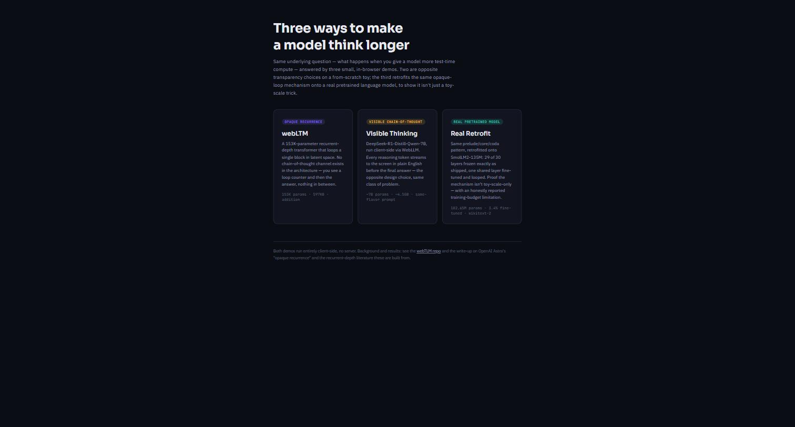
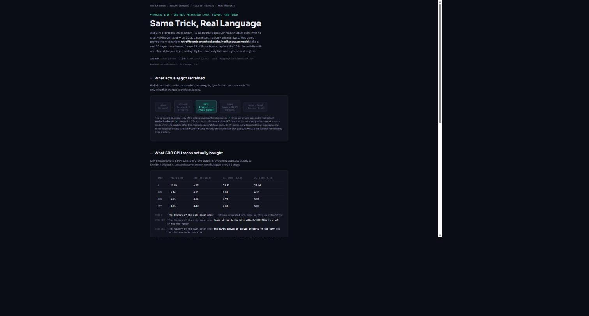
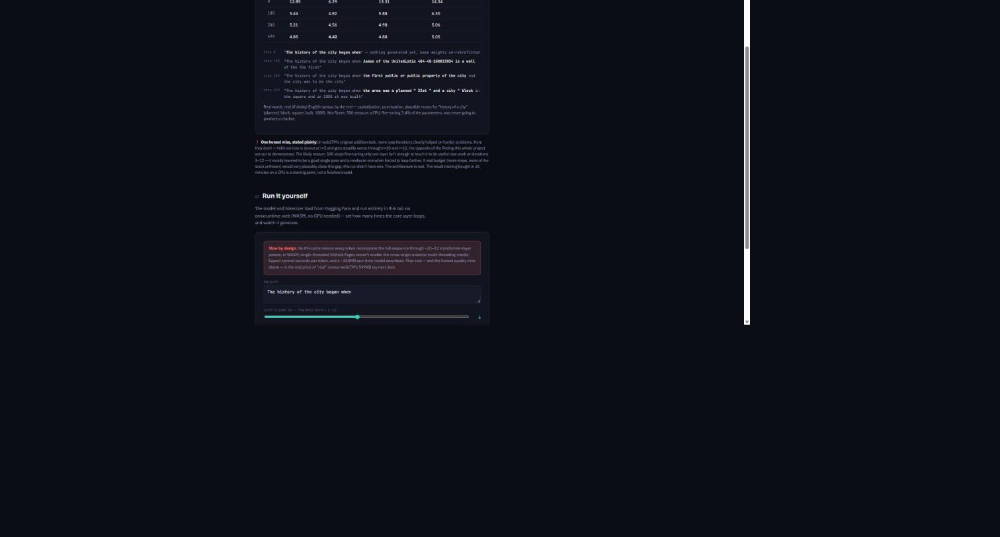
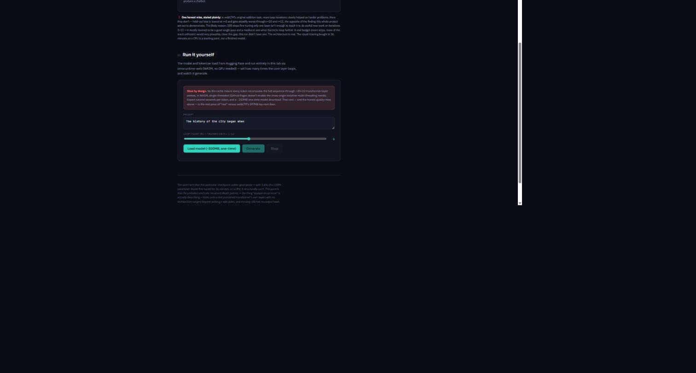
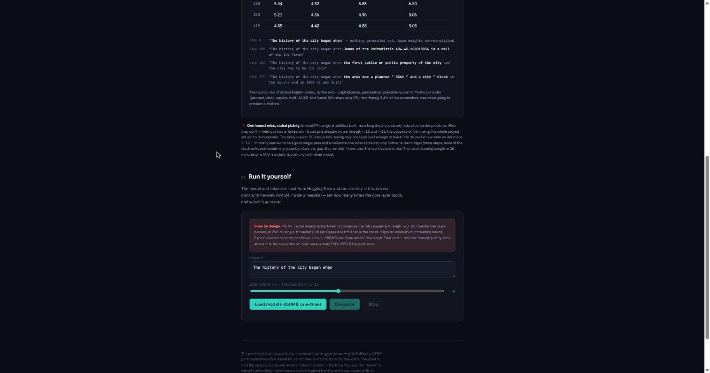
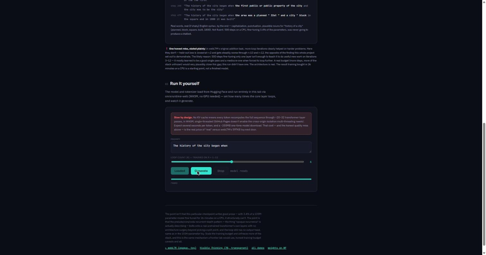
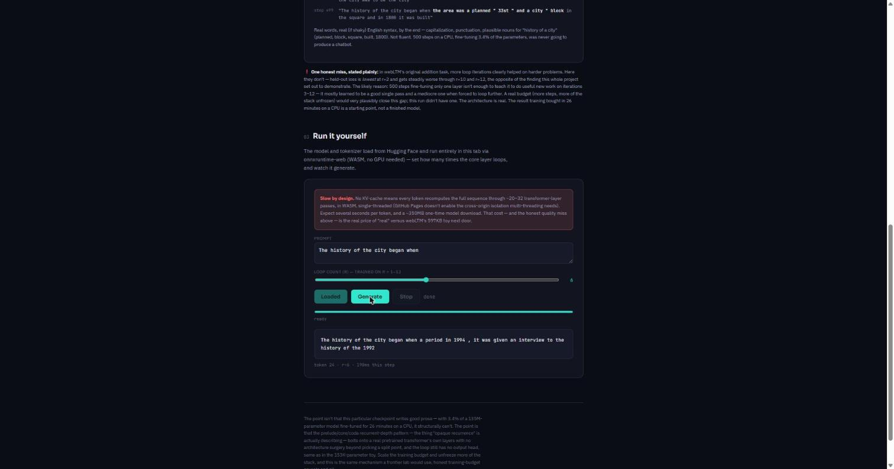
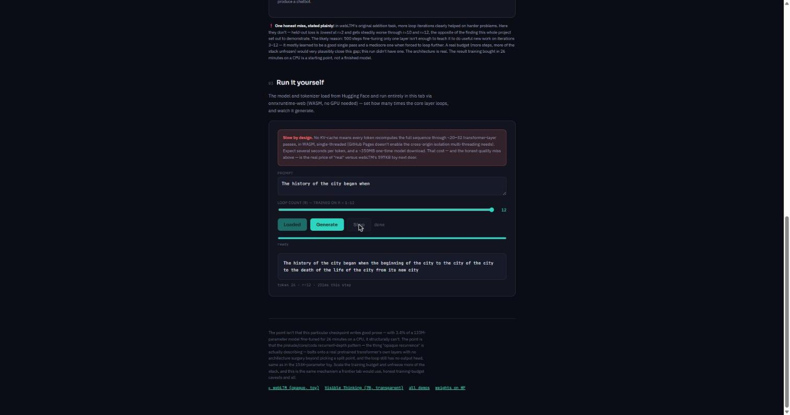
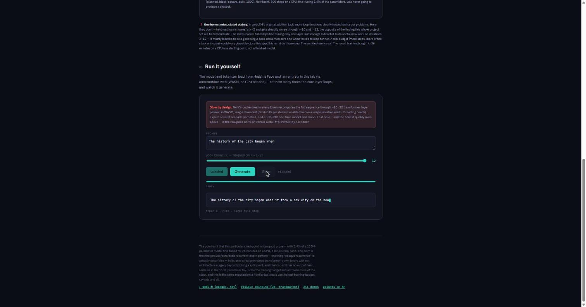

# QA Report: "Real Retrofit" demo (vishalmysore.github.io/webTLM/retrofit/)

**Date tested:** 2026-09-17
**URL:** https://vishalmysore.github.io/webTLM/retrofit/
**Method:** live browser testing (Chrome), clicking through every interactive control, watching console output, and confirming the model actually loads and generates from the Hugging Face-hosted ONNX assets.

**Bottom line: everything works.** The page renders correctly, the ~350MB model loads from Hugging Face with no errors, generation produces real (if rough) English text at multiple loop counts, and the Stop button correctly interrupts generation mid-stream. One cosmetic inaccuracy was found (see "Issues found" below) — not a functional bug, just a warning message that undersells how fast the demo actually runs.

---

## 1. Hub page — all three demos listed

`vishalmysore.github.io/webTLM/` now shows three cards side by side: webLTM (opaque), Visible Thinking, and the new Real Retrofit. Layout, colors (violet / amber / teal), and copy all render as designed.

## 2. Retrofit page — hero and architecture diagram

Navigating to `/retrofit/` loads the page instantly (it's static HTML — the heavy model download only happens after you click "Load model"). The breadcrumb trail reads **webTLM demos / webLTM (opaque) / Visible Thinking / Real Retrofit**, correctly showing where this page sits relative to the other two. The prelude → core → coda architecture strip renders with the "core" block highlighted in teal to show it's the only fine-tuned part.

## 3. Training results table and honest-limitation callout

Scrolling down, the loss table (steps 0/100/300/499, four loss columns) and the four-step sample-generation progression both render correctly, including the bold-highlighted "new" text at each step. The "One honest miss, stated plainly" callout — the paragraph admitting that held-out loss is actually *lowest* at r=2, not the deeper loop counts — displays with its warning icon and stays legible.

## 4. Interactive demo card (before loading)

The "Run it yourself" section shows the slow-by-design warning box, the prompt textarea (pre-filled with "The history of the city began when"), the r-slider (default 6, range 1–12), and all three buttons (Load model / Generate / Stop). Generate and Stop are correctly disabled until a model is loaded.

## 5. Model loading — confirms the Hugging Face assets are live

Clicking "Load model (~350MB, one-time)" kicks off the real sequence: onnxruntime-web loads from CDN, then the tokenizer, then `meta.json` and `rope_table.json`, then the 57MB tied embedding weight, then the three ONNX graphs in order (`trunk_pre.onnx` ~142MB → `core.onnx` ~14MB → `trunk_post.onnx` ~142MB), with a status line and progress bar updating at each step. This is the important check: it confirms the `onnx/` folder upload to `huggingface.co/VishalMysore/webLTM` actually took, and that the browser can fetch cross-origin from HF with no CORS issues.

Total load time end-to-end was **about 35 seconds** on this connection. Button changes to "Loaded", status reads "model ready", and the progress bar fills completely.

## 6. Generation at r=6 (default loop count)

Clicking "Generate" with the default r=6 produced 24 tokens in roughly 5 seconds (**~190ms per token** — see "Issues found" below, this is much faster than the page's own warning suggests):

> "The history of the city began when a period in 1994, it was given an interview to the history of the 1997"

Rough, repetitive, occasionally ungrammatical — exactly what the page promises (3.4% of a 135M-parameter model, fine-tuned for 26 minutes on a CPU). Status correctly shows "done" once generation finishes.

## 7. Loop-count slider and generation at r=12 (max)

Dragging the slider to its maximum (12) works correctly (label updates live). Generating at r=12 took slightly longer per token (**~225–250ms**, consistent with looping the core layer twice as many times) and produced:

> "The history of the city began when the beginning of the city to the city of the city to the death of the life of the city from its new city"

More repetitive/looping text than r=6 — which, interestingly, lines up with the page's own honestly-reported finding that this checkpoint doesn't actually get *better* with more loops.

## 8. Stop button — correctly interrupts generation

Started a fresh generation and clicked Stop almost immediately. Status correctly changed to "stopped" and the output froze mid-sentence at token 8 of the 24-token cap:

> "The history of the city began when it took a new city on the new"

This confirms the stop flag in `model.js`'s generation loop is actually being checked between tokens, not just cosmetic.

## 9. Cross-navigation between all three demos

Checked that the other two demos still work and now link to the new one:

- `webltm/` (the original addition demo): still generates correct sums (tested 4821 + 367 = 5188, marked CORRECT), breadcrumb now ends in "Real Retrofit →", and the footer's "compare:" row has a working link to `../retrofit/`.
- `monitor/` (Visible Thinking / DeepSeek-R1): page loads and renders its comparison table correctly; breadcrumb also ends in "Real Retrofit →". (Did not load the 4.5GB WebLLM model itself — out of scope for this pass, and unrelated to today's changes.)

Both crumbs and footers point at the new demo, and the new demo's own footer links back to both.

---

## Issues found

**1. Minor — the "slow by design" warning oversells the slowness.** The demo's own copy says "expect several seconds per token." In this test, actual generation was **~190ms/token at r=6** and **~225–250ms/token at r=12** — noticeably faster than advertised, likely because WASM SIMD on a modern desktop handles a 102M-parameter model better than the copy assumed when it was written more conservatively. Not a bug, just a place where the expectation-setting could be tightened (or left as a safe floor for slower/older machines — reasonable to leave as-is if you'd rather under-promise).

**2. No functional or console errors.** No CORS failures, no 404s on the Hugging Face assets, no JavaScript exceptions during load, generation, or stop. Every button, slider, and status transition behaved as coded.

No other issues found. The demo is functioning exactly as designed, including honestly reproducing the finding described in its own copy (r=12 output is not obviously better than r=6, consistent with the "held-out loss is lowest at r=2" limitation already documented on the page).
